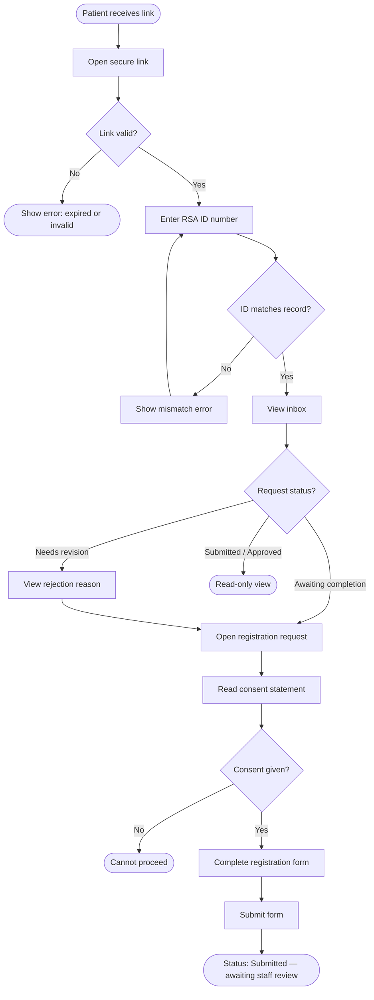
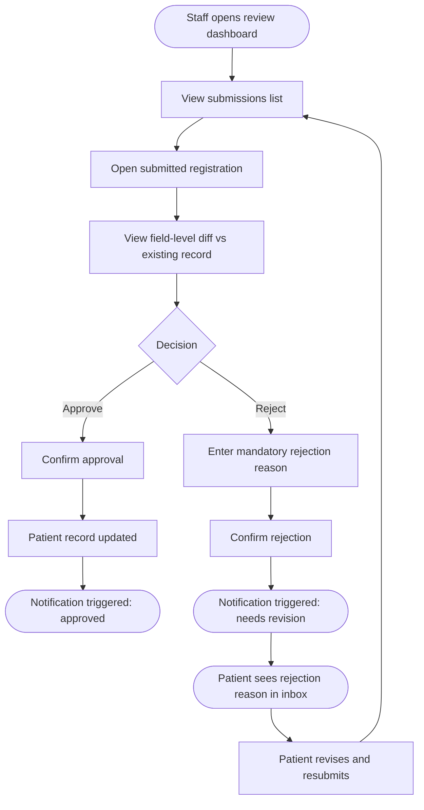

## Overview

This document outlines the business logic and design choices that were made for this project.

The core business logic in this project is focused on the part of a larger medical practice system for registering patients. The part focused on and implemented involves:
- practice staff prompting a user to verify their identity and fill in a registration document
- practice staff reviewing a submitted registration
- approved registration documents updating / populating the user's patient record.

*** See [flowcharts](#user-flow-charts) ***

The resulting system implemented in this project, which would be part of a larger practice management system, is referred to as **PatientReg** from here on out.

### Constraints

1. No SMS or Email sending.
2. No patient login or account creation.

### Assumptions

1. There exists a global database which stores existing, valid South African IDs of real people, which, from the the perspective of **PatientReg** is read-only.
2. Patient data for a given person with a valid ID may or may not exist in a pool of other privately owned databases, many of which **PatientReg** does not necessarily have reading access to.
3. Patients can be linked to more than one practice. This assumption comes from the existence of an inbox feature which allows a user to see registration requests from more than one practice.
4. There was some interaction pre-registration initiation where a patient's identity was verified, i.e. the registration wouldn't be happening in the first place if there wasn't some identity relevant interaction between the practice and the patient which prompted the registration process to be initialited.

### Tradeoffs

1. We will store "existing" south african ID's in **PatientReg**'s database instead of having a seperate database. We will assume that any ID number **PatientReg** has, has already been obtained and hashed from the global database of South African IDs. This simplifies the architecture for the purposes of this project at the cost of being less realistic.
2. We will ignore any existing external patient data and store all patient data inside **PatientReg**'s database. If a record for a patient does not exist in this database, then that patient data does not exist anywhere. Again, this is for the sake of simplicity and comes at the cost of being less accurate in real world scenarios where 9 times of 10 a patient being registered would have some pre-existing data.
3. A registration link is the only way a user can access their registration inbox. This negatively impacts UX, but is a result of the constraint that there is no account creation or login for a user; security is more important than UX. However, if a registration link expires a practice that has a registration request with that patient can resend / generate a new registration link.
4. There is a max resend limit within a timeframe for registration links. This a tradeoff made in favour of security and against UX as a result of other constraints.

### Concerns

1. Registration links are generated using jwt, this means they are tamper proof, but they are not snoop proof. When someone gets their hands on a registration link they can see the contents of this jwt quite [easily](https://www.jwt.io). This means, until the user verifies their identity we want to provide as little information as possible. For this reason the only information in a registration link will be the registration request's uuid, which is intentionally safe for public eyes and does not give any insight into the internal system.
2. Identity verification with just ID number is not foolproof. If someone has access to a registration link and has the "victim's" ID number, they can fill in the registration form on their behalf. While the staff review process does add some level of detail verification and safety, it would be best if there was multi factor authentication, like if an SMS was sent to the phone number associated with the ID number which allows the user to verify their identity.
3. While registration links do expire to decrease the likelihood of link misuse, the possibility of multiple active links does decrease the effectiveness of any individual link's expiry. This is particularly worsened because a registration link acts as a way to access all registration requests for patient. As with concern #2, if MFA were an option it would significantly decrease the severity of this concern.

### Possible Improvements

1. MFA for identity verification; verification link sent to phone number or email associated with ID number.
2. Locking registration for a patient if their information has been compromised, a flag showing that the patient is locked from registration, the option to rollback changes that have been made to their patient data, and unlocking registration if the problem has been resolved.

---

The resulting system design, domain logic and rules follow:

## Core Data Model

**PatientReg** separates:
- Permanent patient records
- Temporary registration requests
- Workflow actions / approvals
- Audit trail

The goal is to allow patients to submit updated information without directly mutating the canonical patient record until reviewed by staff.

The core entities are:
- Practice
- Registration Request
- Patient
- Identity (South African IDs)
- User

### Practice

Details for a practice registered in the system with:
- id
- name

practice has many patients
patient has many practices

### Registration Request

Details for a registration request:
- id
- state (approved, rejected, awaiting completion, awaiting review - submitted)
- patient SA ID (foreign key, hashed)
- practice id (foreign key)

practice id, patient SA ID pair is unique.

patient can have many registration requests
practice can have many registration requests
practice can not have more than one registration request to the same patient

### Identity

Simple table containing records of:
- id
- SA_ID (hashed)

patient has one identity

### Patient

TODO

## User Flow Charts

The below flow charts describe the flow for patient verification and registration from the perspective of the staff and of a patient.

### Patient Flow

### Staff Flow

## Domain Logic

### Link Generation

To protect user and system information a link to the registration url will be generated with a jwt containing the corresponding registration request's hashed patient SA ID. The jwt (and the registration link), expires after 24 hours. This reduces the likelihood of misuse by shortening the gap between the usage of the link and the registration event.

A registration link can not be used more than once. Once it has been accessed the link can not be used again. Furthermore reducing misuse by preventing replay attacks.
Additionally, to address [concern #3](#concerns), any other registration link in circulation is immediately marked as expired when a registration link is generated. This ensures that at any given time only one link can be used to access their registration inbox, and it will also be the link that the user most likely has freshest in their memory, i.e. hopefully they won't go looking for a prior link.
Luckily, practice staff can send new registration links. But this is only feasible in a security sense if assumption [4](#assumptions) is correct; if the user didn't have pre-registration verification we might just be resending a registration link to a bad actor to continue attempting misuse.

We will have to include UI that informs of the user of the expiration behaviour, this will help reduce the amount of times that users 

DL;DR:
- registration links are associated with an SA ID
- there can only be one active registration link at a time
- registration links can not be used again
- registration links can be regenerated upon request
- info necessary to reduce negative impact on UX

### Identity Verification

Incoming input SA ID is hashed and compared against the registration request's hashed SA ID. This introduces a constraint where the SA ID in the registration request **must** contain a valid SA ID.
This verification will correctly verify users who are who they say they are but will **not** correctly filter out bad actors who happen to know the ID number. (read verification security concern #2 [here](#concerns))

Succesful verification will create an empty patient record for that user. Their ID has been verified through existence in a global database as well as through the internal verification step, and can safely be added as patient record with their SA ID being accepted as verified. 

### Registration

A user receives a generated link, verifies their identity, gains access to their inbox and can manage any registration requests associated with their identity number.

## Testing Philosophy

We test interfaces, not implementations. This means that, at each layer, we only care about input x producing output y, not the implementation details. If we follow a clean architecture it would mean that our domain logic is not dependent on what web framework, database or other dependency we use.
This means for example, for any test we write, that we will mock any dependency that might be injected at the infrastructural layer.

This also simplifies our test cases since we don't have to worry about tampering with any persistent state, and all of our tests will be deterministic. Yay :)